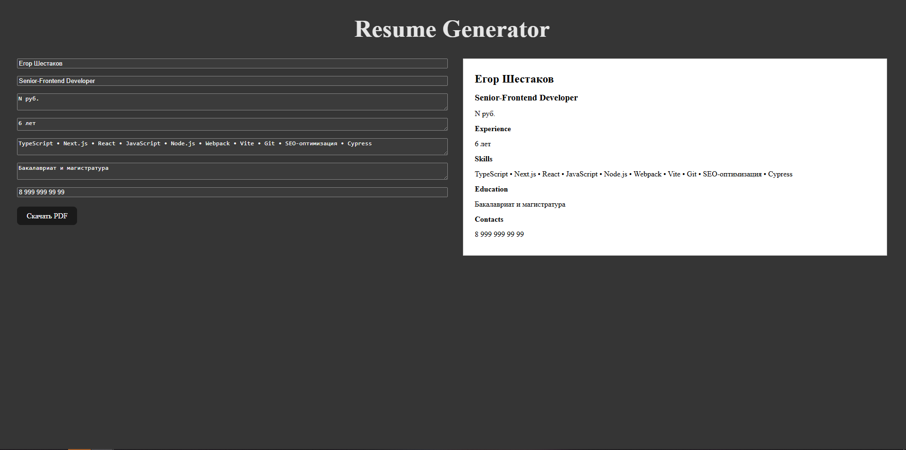

# 📝 Resume Generator

Веб-приложение для быстрого создания и скачивания резюме в формате PDF. Разработано с использованием React, TypeScript, Vite и архитектурного подхода Feature-Sliced Design (FSD).



## 🚀 Функциональность

- Заполнение информации: ФИО, позиция, опыт, навыки, образование, контакты  
- Мгновенное превью готового резюме  
- Генерация PDF одним кликом (через html2pdf.js)  
- Локальное хранение состояния (без бэкенда)  
- Модульные стили с использованием SCSS  
- Архитектура проекта по принципам FSD  

## 🛠️ Стек технологий

- React  
- TypeScript  
- Vite  
- html2pdf.js  
- SCSS Modules  
- Feature-Sliced Design  

## 📁 Структура проекта (FSD)

```

src/
├── app/               # Точка входа и инициализация
├── pages/             # Страницы приложения
├── widgets/           # Составные части интерфейса
├── features/          # Независимые функциональные блоки
├── entities/          # Сущности предметной области
├── shared/            # Общие компоненты, утилиты, стили

````

## ⚙️ Установка и запуск

```bash
git clone https://github.com/egrasimus/resume-generator.git
cd resume-generator
npm install
npm run dev
````

## 📄 Генерация PDF

Используется html2pdf.js — HTML блок с id="resume-preview" захватывается и преобразуется в PDF.

## 📜 Лицензия

MIT License — свободное использование с указанием авторства.

## 👨‍💻 Автор

**Егор Шестаков**

Telegram: [@egrasimus](https://t.me/egrasimus)

Резюме на хабре: [Habr Career](https://career.habr.com/egrasimus)
